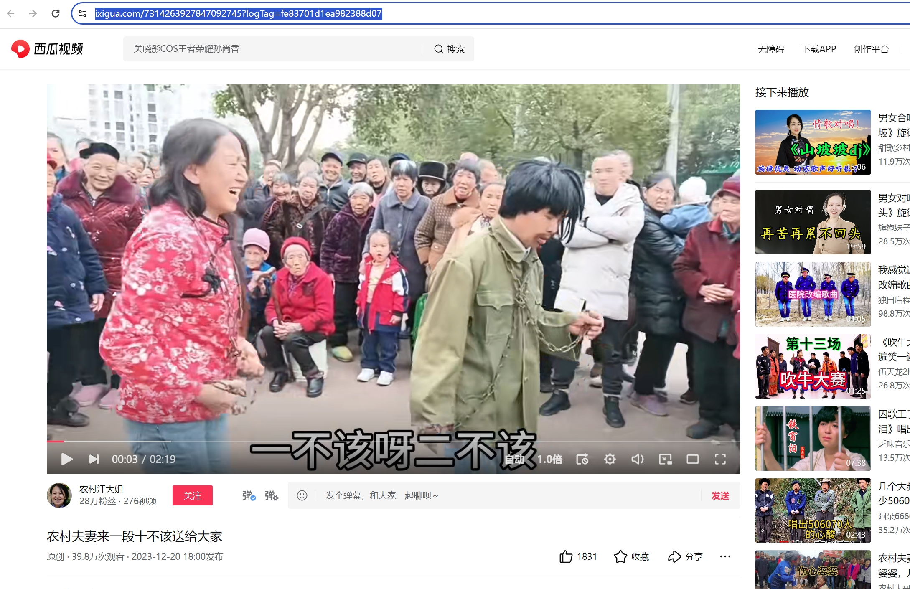
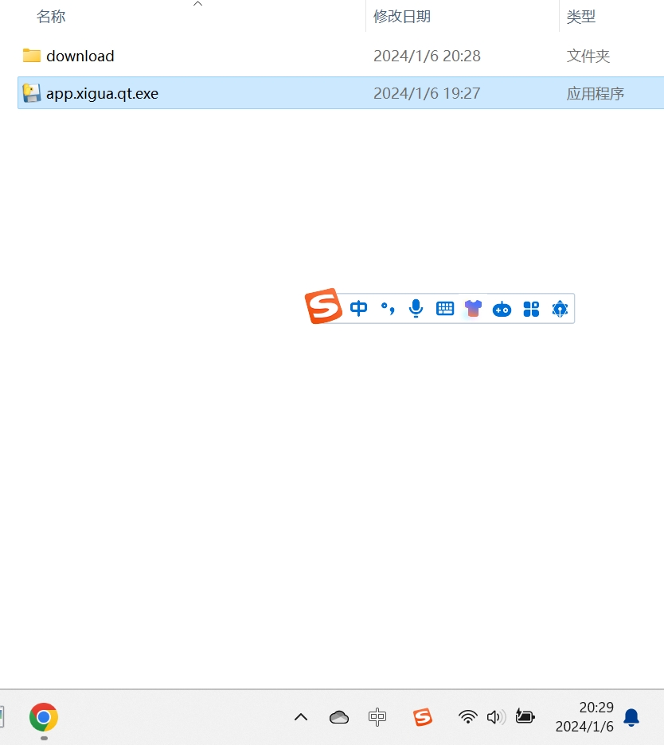
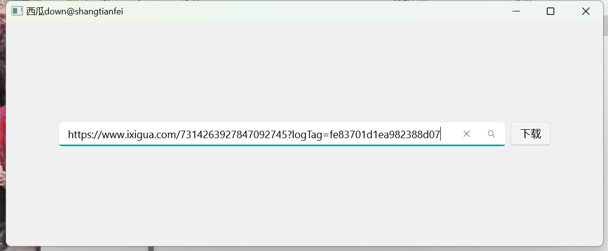

# xigua_down
西瓜视频下载

# 使用方法
## 下载单个视频

1. 将西瓜URL复制下来

    e.g.

    

2. 双击 西瓜视频.exe

    e.g.

    

3. 在窗口输入 复制的链接，点击下载按钮，等待

    e.g.

    

4. 下载完成后 西瓜视频.exe 所在目录会自动生成download文件夹，文件夹里面会有链接对应的视频

    e.g.

        

        e.g.

        

## 下载多个视频
todo。。。
